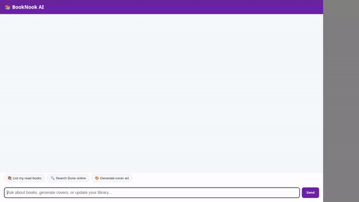

# BookNook AI 📚

An intelligent reading concierge and personal bookshelf assistant built with Google Agent Development Kit (ADK), Gemini 2.5 Flash, Firestore, Cloud Storage, and A2UI rich interfaces.



---

## Features & Capabilities

- **Personal Bookshelf Management (Firestore)**:
  - Add, track, and update books in your personal library (`list_books`, `add_book`, `update_book_status`).
  - Stores reading status (`want_to_read`, `currently_reading`, `read`), page counts, ratings, and reviews in Google Cloud Firestore.

- **Long-Term Memory Bank**:
  - Remembers your favorite authors, genres, and reading preferences across sessions using Agent Engine Memory Bank (`PreloadMemoryTool`).

- **Generative Media Tools**:
  - **Custom Cover Art**: Generates AI book covers using `gemini-3.1-flash-lite-image`, uploads them to Google Cloud Storage, and displays them inline.
  - **Book Trailer Videos**: Generates short animated teaser videos using Google's Omni model (`gemini-omni-flash-preview` in the `global` region) and uploads them to Google Cloud Storage.

- **Online Catalog & Free EBook Search**:
  - Live book lookup via Open Library API (`search_online_books`).
  - Search free public domain eBooks from Project Gutenberg via Gutendex API (`get_free_ebooks`).

- **Secure Python Code Sandbox**:
  - Executes Python code in a sandboxed Agent Engine environment (`AgentEngineSandboxCodeExecutor`) to compute reading velocity, page statistics, and library analysis.

- **A2UI Rich Component Rendering**:
  - Renders interactive Cards, Columns, Rows, Text, and Images using A2UI v0.8 schema manager and custom after-model callback.

---

## Google Cloud Services Integrated

- **Google Cloud Firestore**: Persists library state in the `books` collection.
- **Google Cloud Storage**: Stores generated cover images and trailer videos in a public Cloud Storage bucket.
- **Agent Engine Sandbox**: Secure code execution environment for Python computations.
- **Agent Engine Memory Bank**: Stores session conversation events for preference extraction.
- **Gemini Models**:
  - `gemini-2.5-flash` (Main Reasoning & Orchestration)
  - `gemini-3.1-flash-lite-image` (Image Generation)
  - `gemini-omni-flash-preview` (Video Generation)

---

## Local Setup & Run Instructions

### Prerequisites
- Python 3.11+
- `google-agents-cli` / `agents-cli` installed
- Google Cloud SDK authenticated with active project access

### Running the Agent

1. **Install Dependencies**:
   ```bash
   uv pip install -r requirements.txt
   ```

2. **Test Agent via CLI**:
   ```bash
   agents-cli run "List my read books"
   ```

3. **Start Local Web Frontend**:
   ```bash
   cd frontend
   pip install -r requirements.txt
   python main.py
   ```
   Navigate to port `8080` in your local web browser.

---

## Project Structure

```
.
├── app/
│   ├── agent.py         # Main ADK Agent logic, tools, and A2UI system prompt
│   ├── a2ui_utils.py    # A2UI callback and JSON extraction
├── frontend/
│   ├── main.py          # FastAPI proxy server
│   ├── static/          # Plain web chat UI (index.html)
│   └── Dockerfile       # Container definition for Cloud Run
├── agents-cli-manifest.yaml
├── demo.gif             # Recorded demo animation
└── README.md
```
